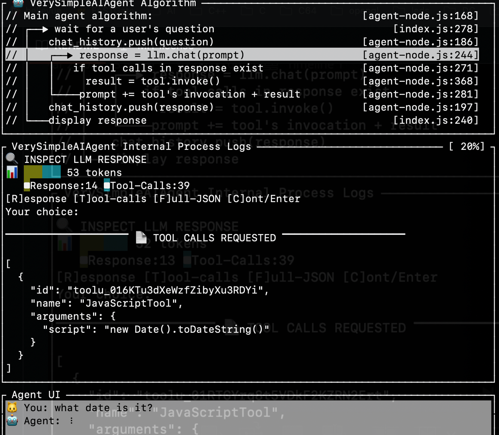

# VerySimpleAIAgent

The objective of this project is to demystify what an LLM based agent is and what it's actually doing by looking at how an agent is implemented in code.

Jump to the [**Complete Explanation**](#-complete-explanation) to discover how agents work!

## 📑 Table of Contents

- [VerySimpleAIAgent](#verysimpleaiagent)
  - [📑 Table of Contents](#-table-of-contents)
  - [✨ Features](#-features)
  - [🚀 Quick Start](#-quick-start)
    - [How It Works](#how-it-works)
  - [📖 Complete Explanation](#-complete-explanation)
    - [How LLMs and Agents Work Together](#how-llms-and-agents-work-together)
    - [The Agentic Loop](#the-agentic-loop)
    - [Why This Works](#why-this-works)
  - [🔧 Configuration](#-configuration)
  - [🛠️ Available Tools](#️-available-tools)
    - [JavaScriptTool](#javascripttool)
    - [ShellCommand](#shellcommand)
    - [ThinkTool](#thinktool)

## ✨ Features

- 🤖 **LLM-Powered**: Works with Azure OpenAI, OpenAI, Anthropic (Claude), or Ollama
- 🔄 **Multi-Iteration Agent**: Automatically handles complex multi-step tasks (up to 42 iterations)
- 🛠️ **Three Tools**: JavaScriptTool (VM sandbox), ShellCommand (with confirmation), ThinkTool (reasoning)
- 🔍 **Interactive Inspection**: Review prompts and responses with token breakdown before/after each LLM call
- 🎯 **Phase-Based Debugging**: Real-time algorithm visualization with current execution phase highlighted
- 📊 **Token Visualization**: Color-coded token usage by component (system, tools, user, assistant, results)
- 🔒 **Secure**: VM sandbox for JavaScript, user confirmation for shell commands



## 🚀 Quick Start

```bash
npm install
npm start
```

> **Tip**: `npm start` is the short form of `npm run start`.

Type `config` to configure your LLM provider, then start chatting!

**Commands**: `config`, `history`, `help`, `bye`

### How It Works

The agent's core algorithm loops until the task is complete:

```
// ┌──▶ wait for a user's question
// │   chat_history.push(question)
// │   ┌──▶ response = llm.chat(prompt)
// │   │   if tool calls in response exist
// │   │     result = tool.invoke()
// │   └─────prompt += tool's invocation + result
// │   chat_history.push(response)
// └───display response
```

The algorithm is displayed in the top panel with the current phase highlighted as it executes.

## 📖 Complete Explanation

### How LLMs and Agents Work Together

**LLMs are stateless HTTP endpoints** - each API call is independent, with no memory between requests. The agent solves this by:
1. Maintaining conversation history
2. Including all previous messages in each request
3. Executing tools locally and adding results to the conversation

### The Agentic Loop

**User asks**: "What day is it?"

1. Agent adds question to history
2. Agent sends to LLM with system prompt, tools, and history
3. LLM responds with a tool call request (see [screenshot](inspection.png)):
```json
{"tool_calls": [{"function": {"name": "JavaScriptTool", ... { "script": "new Date().toLocaleDateString()"}}]}
```
4. Agent executes tool locally → `"Thursday, October 31, 2025"`
5. Agent adds tool call + result to conversation *(loop repeats from step 2)*
6. LLM responds with final answer (no tool calls):
```json
{"content": "Today is Thursday, October 31, 2025."}
```
7. Loop exits, agent saves response to history
8. Display answer to user

### Why This Works

- **Agent**: Maintains state, executes tools, controls the loop
- **LLM**: Decides which tools to use, interprets results, formulates responses
- **Tools**: Provide real-world capabilities (calculations, shell commands, reasoning)

The loop continues until the LLM has everything it needs to answer.

## 🔧 Configuration

Run `config` command or edit `.agent-config.json`:

```json
{
  "provider": "azure",
  "apiKey": "YOUR-API-KEY",
  "endpoint": "https://YOUR-RESOURCE.openai.azure.com/openai/deployments/YOUR-DEPLOYMENT/chat/completions?api-version=2024-02-15-preview",
  "model": "gpt-4"
}
```

**Supported providers**: Azure OpenAI, Open AI, Anthropic (Claude), Ollama, Custom

You can also use environment variables: `OPENAI_API_KEY`, `OPENAI_ENDPOINT`, `OPENAI_MODEL`


## 🛠️ Available Tools

### JavaScriptTool
Executes JavaScript in a secure VM sandbox (no filesystem/network access, 5-second timeout).

```javascript
Math.sqrt(144)  // Simple math
new Date().toLocaleDateString()  // Current date
[1,2,3].reduce((a,b) => a+b, 0)  // Array operations
```

### ShellCommand
Executes shell commands with Y/N confirmation.

```bash
ls -la
git status
curl -I https://example.com
```

### ThinkTool
Internal reasoning and analysis before taking action.

---

**Author**: Luca Cappa ([@lukka](https://github.com/lukka))  
**License**: MIT  
**Repository**: [github.com/lukka/VerySimpleAIAgent](https://github.com/lukka/VerySimpleAIAgent)
